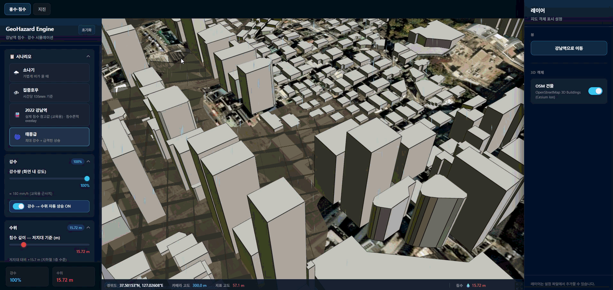
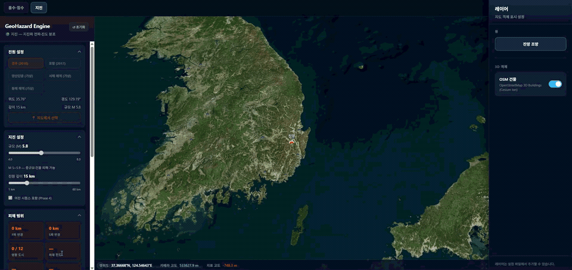

# GeoHazard Engine

재난 유형별 **적합한 위치**에서 교육용 시뮬레이션을 체험하는 Cesium 3D 지도 앱입니다 (React + Vite).

| 탭 | 위치·내용 | 상태 |
|----|-----------|------|
| **홍수·침수** | 강남역 — 강수·수위·terrain grid 침수 | ✅ 배포 |
| **지진** | 단층대·역사 지진 프리셋 — P/S파 ring, MMI, OSM 건물, 여진 | ✅ 배포 |
| **쓰나미** | 동해·연안 — 파면 전파 | ⏸ 보류 (WebGL 3D 파도 통합 후) |

**Production**: [geohazard-engine.vercel.app](https://geohazard-engine.vercel.app)

> 교육·체험용 **단순화 모델 + 3D 연출**에 집중합니다. 정밀 CFD/구조 해석은 대상이 아닙니다.

## 스크린샷

| 홍수·침수 — 2022 강남역 시나리오 | 지진 — P/S파 확산 + MMI + 건물 흔들림 |
|:---:|:---:|
|  |  |
| terrain grid 침수 + OSM 건물 + 강수 파티클 | P파·S파 ring, 도시 MMI 마커, MMI overlay, 피해 통계 |

## 문서

| 문서 | 설명 |
|------|------|
| [docs/README.md](./docs/README.md) | 문서 목차·읽는 순서 |
| [docs/goals.md](./docs/goals.md) | 로드맵, 재난별 Phase, 배포 |
| [docs/features.md](./docs/features.md) | 구현 기능, 파일 구조, 테스트 |
| [docs/session-handoff.md](./docs/session-handoff.md) | 현재 상태·다음 작업 요약 |
| [docs/earthquake-status.md](./docs/earthquake-status.md) | 지진 모듈 (Phase 1~4 · QA PASS) |
| [docs/earthquake-qa.md](./docs/earthquake-qa.md) | 지진 브라우저 QA 결과 |
| [docs/tsunami-status.md](./docs/tsunami-status.md) | 쓰나미 ⏸ WebGL 파도 통합 전 |

## 기술 스택

- React 19 + Vite
- [Cesium](https://cesium.com/) / [Resium](https://resium.reearth.io/)
- `vite-plugin-cesium` (Production Workers/WASM 번들)
- Vitest · Playwright (QA 스크립트)

## 빠른 시작

```bash
npm install
cp .env.example .env   # VITE_CESIUM_TOKEN 입력
npm run dev
```

[Cesium Ion](https://ion.cesium.com/)에서 토큰을 발급받아 `.env`에 설정합니다.

| 스크립트 | 설명 |
|----------|------|
| `npm run dev` | 개발 서버 (localhost:5173) |
| `npm run build` | Production 빌드 |
| `npm run preview` | 빌드 결과 미리보기 |
| `npm run lint` | ESLint |
| `npm test` | Vitest 단위 테스트 |

## 주요 기능

### 홍수·침수 (강남역)


- terrain grid + 저지대 기준 수면, 2D 파동, 하늘 반사 셰이더
- 강수 ParticleSystem, 강수량 → 수위 자동 상승
- pitch view bounds — 카메라 각도에 맞춘 침수·강수 범위
- 시나리오 프리셋 (2022 강남역 등)

### 지진 (한반도 단층·해역)


- P파·S파 ring 확산, 도시 MMI 마커, 카메라·건물 쉐이크
- MMI ImageryLayer overlay, 피해 통계 (면적·인구 추정)
- OSM 건물 손상색 + CustomShader 흔들림
- 여진 시퀀스, 지표 균열, 액상화 overlay (Phase 4)
- 타임라인·스크러빙, 5개 진원 프리셋 + 지도 클릭 진앙

### 쓰나미 (보류)

- `src/modules/tsunami/`에 Phase 1 프로토타입 보존
- **재개 조건**: 별도 **WebGL 3D 파도 애니메이션** 완료 → Cesium 통합 후 탭 재노출
- 상세: [docs/tsunami-status.md](./docs/tsunami-status.md)

### 공통

- `ModuleShell` 탭 UI — `registry.js` 모듈 라우터
- OSM 건물 — 우측 레이어 패널 토글 (Ion 토큰 필요)

## 프로젝트 구조 (요약)

```
src/
├── App.jsx
├── components/          # CesiumMapViewer, ModuleShell, SceneLayersPanel, …
├── locations/gangnam.js
├── modules/
│   ├── registry.js      # flood, earthquake (tsunami 미등록)
│   ├── flood/
│   ├── earthquake/      # Phase 1~4
│   └── tsunami/         # 프로토타입 (보류)
├── physics/
│   ├── WaterWaveEngine.js
│   ├── EarthquakeWaveModel.js
│   └── TsunamiWaveModel.js
└── utils/
```

## QA

```bash
npm test                    # Vitest (109+ passed)
node qa-earthquake-full.mjs # 지진 Playwright QA (dev 서버 필요)
```

## 배포

- `main` → Vercel Production
- `dev` → Vercel Preview
- 환경 변수: `VITE_CESIUM_TOKEN`

상세: [docs/goals.md](./docs/goals.md)
